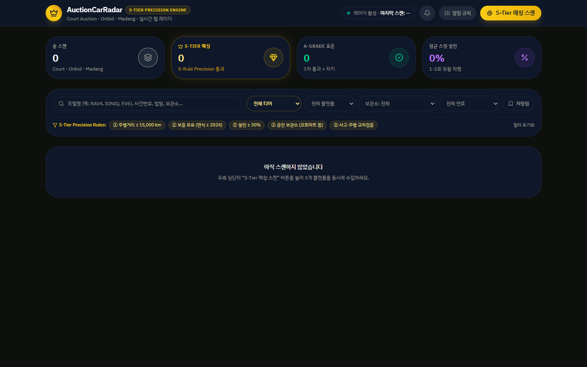
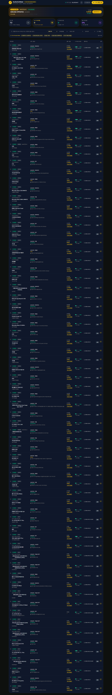
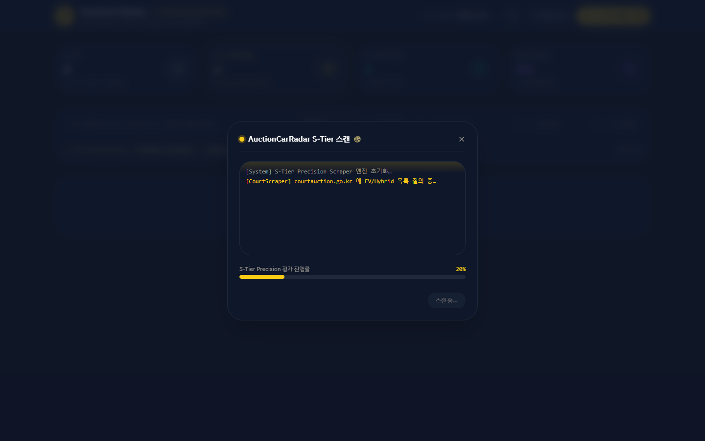
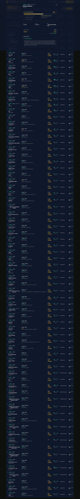

# AuctionCarRadar

> A precision radar for **high-value eco-cars** at Korean court auctions and public sales.

AuctionCarRadar automatically scrapes three Korean auction platforms, filters out the noise, and surfaces only the cars worth bidding on — graded **A-Grade** (meets all baseline rules) or **S-Tier** (passes a 5-rule precision check that includes official-keeper storage and warranty validation).

[](LICENSE)
[](https://nodejs.org)
[](https://www.typescriptlang.org/)

[🇰🇷 한국어 README](README.ko.md) · [Beginner's Guide](HOW_TO_RUN.md)

---

## Screenshots

| Dashboard | Live scan + detail modal |
| --- | --- |
|  |  |

| S-Tier Simulation | Detail Scorecard |
| --- | --- |
|  |  |

---

## What it does

Korean auctions publish 50–80 cars per scan. Manually browsing them is slow, and the *good* cars (newly-listed, low-mileage hybrid/EV at sweet-spot prices) get buried under hundreds of less-interesting listings.

AuctionCarRadar does the boring part:

1. **Scrapes** 3 platforms every 6 hours (or on demand):
   - 대법원 법원경매 — `courtauction.go.kr` (Court Auctions)
   - 캠코 온비드 — `onbid.co.kr` (Korea Asset Management Corp)
   - 경매마당 — `madangs.com` (Madang)
2. **Filters** with explicit rules: year ≥ 2022 · mileage ≤ 50,000 km · hybrid/EV only · has-key keywords · no wreck/flood/lien keywords
3. **Grades** survivors with a 5-rule **S-Tier** precision check:
   - **①** Mileage ≤ 15,000 km
   - **②** Manufacturer warranty still valid (year ≥ 2024)
   - **③** Discount ≥ 30% (1–2 unbid sweet spot)
   - **④** Stored at official / professional keeper (Automart, AutoHub, Onbid 캠코, etc.)
   - **⑤** Accident history + mileage cross-validated
4. **Stores** history locally in PGLite (Postgres-compatible single-file DB)
5. **Alerts** via in-app bell + optional Telegram bot

---

## Quick start

Requires **Node.js 22+**. Clone the repo and:

```bash
npm install
npm run dev
```

Then open <http://localhost:8080> in your browser. Click the big yellow **"S-Tier 매칭 스캔"** button on the top-right to trigger a live scan.

For the full beginner-friendly walkthrough (with screenshots and what each button does), see [HOW_TO_RUN.md](HOW_TO_RUN.md).

---

## Tech stack

| Layer | Choice | Why |
| --- | --- | --- |
| Framework | [TanStack Start](https://tanstack.com/start) | SSR + server functions + file-based routing |
| UI | React 19 + Tailwind v4 | Modern, fast, dark-mode native |
| State | [Zustand](https://zustand-demo.pmnd.rs/) + persist middleware | Lightweight, no provider hell |
| Database | [PGLite](https://github.com/electric-sql/pglite) (Postgres in WASM) | Single-file DB, no Docker required |
| Scrapers | Native `fetch` + custom HTML/JSON parsers | No headless browser overhead |
| Tests | `node --test` + [Playwright](https://playwright.dev) | Zero-config unit + E2E |

---

## Project layout

```
car_auction/
├── src/
│   ├── lib/radar/           # scrapers, parser, filter, S-Tier scorer, persistence
│   │   ├── scrapers/        # court / onbid / madang
│   │   ├── parser.ts        # year / mileage / fuel extraction
│   │   ├── filter.ts        # 1차 통과 / A급 grading
│   │   ├── stier.ts         # 5-rule S-Tier precision evaluator
│   │   ├── persistence.ts   # PGLite-backed durable scan history
│   │   ├── scan.ts          # orchestrates the 3 scrapers + grading
│   │   └── store.ts         # client-side Zustand state
│   ├── components/radar/    # dashboard components
│   │   ├── spotlight-banner.tsx
│   │   ├── metrics-cards.tsx
│   │   ├── filter-bar.tsx
│   │   ├── listings-table.tsx
│   │   ├── detail-modal.tsx
│   │   ├── scan-modal.tsx
│   │   ├── settings-modal.tsx
│   │   └── notification-drawer.tsx
│   ├── routes/              # TanStack Start file-based routes
│   │   ├── __root.tsx
│   │   ├── index.tsx        # the dashboard
│   │   └── api/cron/radar.ts # 6h scheduled scan endpoint
│   └── styles.css           # Tailwind + design tokens
├── migrations/              # Postgres SQL migrations
│   ├── 0002_radar.sql       # core radar schema
│   └── 0003_radar_stier.sql # S-Tier precision fields
├── scripts/
│   ├── verify-stier-dashboard.mjs  # Playwright static smoke
│   ├── verify-stier-flow.mjs       # Playwright full E2E
│   ├── run-scheduled-radar.mjs     # Manual 6h scan trigger
│   ├── verify-scrapers.mjs         # Test the 3 scrapers live
│   └── with-app-env.mjs            # Wraps vite with .env loading (cross-platform fix)
└── screenshots/             # Dashboard captures used in the README
```

---

## Running the tests

```bash
npm run typecheck                            # TypeScript strict mode
node --test src/lib/radar/parser.test.ts    # 11/11 parser unit tests
node --test src/lib/radar/stier.test.ts     # 11/11 S-Tier detector tests
node scripts/verify-stier-flow.mjs          # 10/10 Playwright E2E
```

The S-Tier detector tests include the three prototype benchmark listings from the design contract — proving the detector catches real S-Tier patterns when they appear in the data.

---

## Deploying to production

The build output targets **Vercel** + **Nitro**:

```bash
npm run build       # produces .vercel/output/
vercel --prod       # deploy
```

A `vercel.json` is included with a 6-hour cron that hits `/api/cron/radar` so scans run automatically.

For database durability across deploys, point `DATABASE_URL` at a real Postgres (e.g. [Neon](https://neon.tech), free tier works).

---

## Optional: Telegram alerts

```bash
TELEGRAM_BOT_TOKEN=... TELEGRAM_CHAT_ID=... npm run dev
```

Then click **알림 규칙** in the dashboard, paste the values, save. New S-Tier matches ping your phone.

> The bot token is read from environment only and never persisted to localStorage.

---

## Important: scraping ethics & terms of service

The three Korean auction platforms cited above **forbid automated scraping in their Terms of Service**. AuctionCarRadar is intended for **personal, non-commercial research** — it makes modest request volumes and respects `robots.txt` where applicable.

If you fork or self-host this project:

- Keep request rates low (default cadence: 1 scan per 6 hours)
- Don't redistribute the scraped data publicly
- Don't repackage this as a paid service that competes with the original platforms
- If a platform asks you to stop, stop

The code is open-source for **transparency and self-education**, not to industrialize scraping.

---

## Roadmap

- [x] Real scrapers for all 3 platforms (Court blocked-by-design)
- [x] A-Grade + S-Tier grading with 0–100 score
- [x] TanStack Start dashboard with 8 components
- [x] SQLite/PGLite durable scan history
- [x] Vercel cron + Telegram alerts
- [x] Unit tests (22 passing) + Playwright E2E (10 passing)
- [x] S-Tier precision hardening with prototype benchmark tests
- [ ] Per-platform scraper accuracy improvement (rawText → address/keeper extraction)
- [ ] Multi-region IP rotation for resilience
- [ ] Optional read-only public mirror

---

## License

[MIT](LICENSE) — use it, fork it, learn from it.

## Contributing

See [CONTRIBUTING.md](CONTRIBUTING.md). PRs welcome for bug fixes, scraper accuracy, and UI polish. New auction sources need careful work to respect the platforms' boundaries.

---

<sub>Built as a personal research tool. The Korean-market car-auction ecosystem is small but fascinating — and the public-interest side of "easier access to cheap reliable eco-cars" is real, even if the legal side is gray. Use responsibly.</sub>